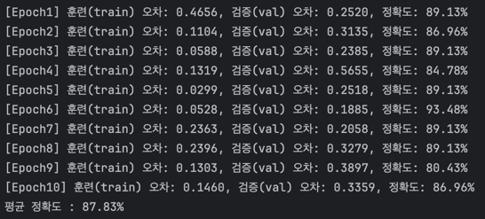
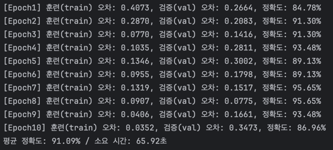
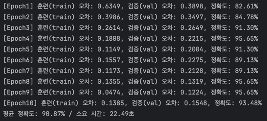

# ⚙️ Plastic Sorting AI
> 플라스틱 이미지 분류 AI  
> 2025.10.28. ~ 

 

## 🛠️ 스택
- 언어 : Python 3.9
- 라이브러리 : PyTorch, TorchVision, PIL
- 모델 : ResNet18
- 데이터 처리 : ImageFolder, transforms
- 환경 : MacBook(Apple M4) / IntelliJ

 

## 🗂️ 데이터 셋
dataset/  
├─ train/  
│   ├─ PLASTIC/  
│   └─ NON_PLASTIC/  
└─ val/  
├─ PLASTIC/  
└─ NON_PLASTIC/  
- icrawler로 Google Image 수집 후 라벨링

 

## 📈 학습 결과
## 프로토타입
### 🔍 스펙
- 모델: ResNet18 (pretrained=True)
- 입력 크기: 255×255
- 정규화: mean/std = [0.5, 0.5, 0.5]
- 옵티마이저: Adam(lr=0.0005)
- 에폭: 10

### 📚 결과

 

## V1 (전처리 보완)
### 🔍 변경 사항
- 입력 크기: 255×255 -> 244x244
- 정규화: mean/std = [0.5, 0.5, 0.5] -> [0.485, 0.456, 0.406]/[0.229, 0.224, 0.225]
- 옵티마이저: Adam(lr=0.0005) -> 0.0001

### 📚 결과

 

## V2 (학습 데이터 증강)
### 🔍 변경 사항
- 데이터 증강(train 데이터 변형)

### 📚 결과

 

## V3 (CPU -> GPU)
### 🔍 변경 사항
- cpu -> mps
- nn.Dropout(0.3) 추가
- 옵티마이저: Adam(lr=0.00005)

### 📚 결과

